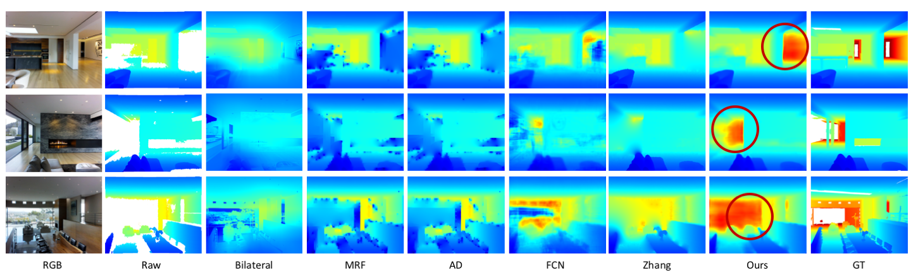

# Indoor Depth Completion with Boundary Consistency and Self-Attention

Official pytorch implementation of "Indoor Depth Completion with Boundary Consistency and Self-Attention. Huang et al. RLQ@ICCV 2019." [arxiv](https://arxiv.org/abs/1908.08344) 

In "Indoor Depth Completion with Boundary Consistency and Self-Attention. Huang et al. RLQ@ICCV 2019.", we design a neural network which utilizes self-attention mechanism and boundary consistency concept to improving completion depth maps. Our work enhances the depth map quality and structure, which outperforms previous state-of-the-art depth completion work on Matterport3D dataset.



Implementation details and experiment results can be seen in the paper.

## Environment Setup

On x86\_64 GNU/Linux machine using Python 3.6.7

```bash
git clone git@github.com:patrickwu2/Depth-Completion.git
cd Depth-Completion
pip3 install -r requirements.txt
```

## Training / Testing

Please see [train\_test](doc/train_test.md)

## Visualization / Evaluation

Please see [vis\_eval](doc/vis_eval.md)

## Authors

Yu-Kai Huang [kaikai4n](https://github.com/kaikai4n) r08922053@ntu.edu.tw

Tsung-Han Wu [tsunghan-wu](https://github.com/tsunghan-wu) b05902013@ntu.edu.tw

Please cite our papers if you use this repo in your research:

```
@article{huang2019indoor,
  title={Indoor Depth Completion with Boundary Consistency and Self-Attention},
  author={Huang, Yu-Kai and Wu, Tsung-Han and Liu, Yueh-Cheng and Hsu, Winston H},
  journal={arXiv preprint arXiv:1908.08344},
  year={2019}
}
```

## Acknowledgement

This work was supported in part by the Ministry of Science and Technology, Taiwan, under Grant MOST 108-2634-F-002-004, FIH Mobile Limited, and Qualcomm Technologies, Inc., under Grant NAT-410477. We are grateful to the National Center for High-performance Computing.

